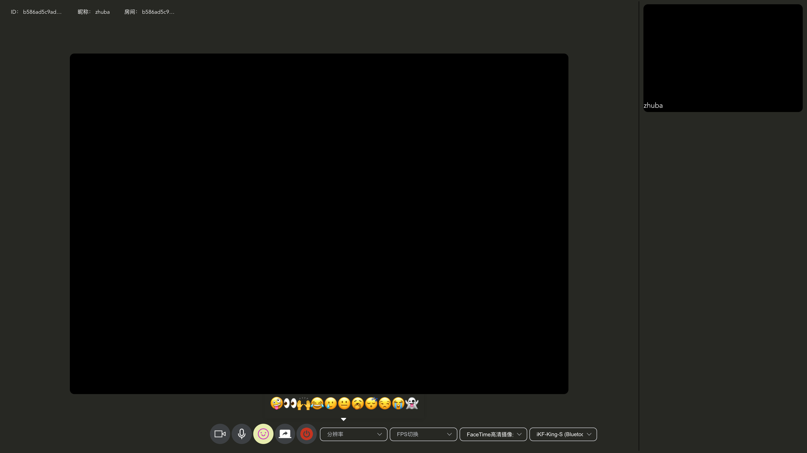

# webrtc-chat

## 简单使用

[在线体验地址](https://nrtc.wangsrbus.cn/#/)
多人视频可以通过粘贴他人提供的房间号进入，注意记得给予浏览器视频音频




## 已完成

- 增加群聊消息提醒功能
- 完成单人点对点频通话
- 完成群视频通话
- 完成屏幕分享

----

- [x] 登录接口
- [x] 加载聊天记录接口
- [x] 加载通讯录好友或群组接口
- [x] 申请加对方为好友接口
- [x] 加载待处理好友申请接口
- [x] 同意好友申请接口
- [x] 搜索非好友用户接口

----

## 部署

### 前端

```bash
cd webrtc-chat-前端
# 安装依赖
npm i
## 本地调试
npm run serve
## 清楚语法错误
npm run lint
## 配置好各项参数和后端联调 打包 在dist文件夹
npm run build
```

----

### 后端

```bash
1. 安装并运行MySQL，在项目application.yaml文件中填写配置，包括MySQL的url、账号、密码，tomcat的端口，socketio的端口等
2. 执行maven中default生命周期中的package阶段，将项目打包为jar包
3. 将jar包复制到服务器中，设置好其启动参数，于后台稳定运行
```

## 待完善

- 移动端适配不够
- 界面比较友好但不够美观

## 参考资料

[WebRtc实现多人视频会议以及视频录制上传](https://juejin.cn/post/6887147825113595911)
[webrtc实现群聊系列文章(一)本地模拟视频通话](https://juejin.cn/post/6866252061336567822)
[webrtc实现视频群聊系列文章(二)实现网络中一对一视频聊天](https://juejin.cn/post/6866252687462105101)
[webrtc实现视频群聊系列文章终章之完成即时通讯+多人视频会议](https://juejin.cn/post/6870299373708771336)
[webrtc打造群视频聊天系列之视频聊天和屏幕分享随意切换](https://juejin.cn/post/6868469564611821576)
[WebRTC 从实战到未来！前端如何实现一个最简单的音视频通话？🔥](https://juejin.cn/post/7165539003465531399)
